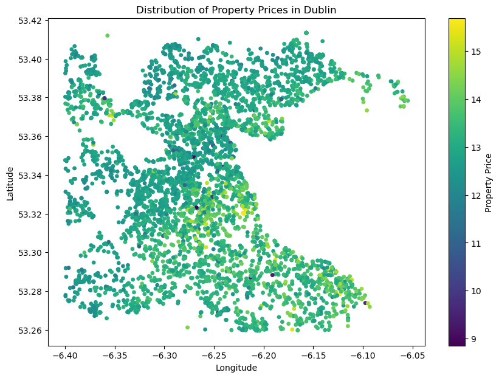

# Irish Housing
Clustering model for Irish housing prices based on geographical location. The dataset contains all properties sold in 2023, available through the public property register [here] (https://www.propertypriceregister.ie/Website/NPSRA/pprweb.nsf/page/ppr-home-en).  

Data has been processed in the following way:

## Geocoding and Preprocessing
Google Maps API was used to determine locations from the address that was available in the property description. Usually, this method was accurate enough, only resulting in a handful of ??? values. These were mainly removed by constraining on the coordinates on only the country boundaries. The other issue with the dataset taken as it is, there are commercial properties that have been left on the register. Given the relatively small size, they have been removed manually, but there is an option to create a more complex filtering rule to rule them out, their primary characteristic being multiple house numbers (for a hypothetical, the commercial would be 17-24 Maple Street and residential 18 Wood Street), and a high price to account for the quantity. It is reasonable to assume that the processed dataset would not contain many of such entities.  

## Visualisation
Some baseline plots include the colour coding the geographical locations. These plots are demonstrated below for national prices:    

  

And for the Dublin region specifically:  

However, a more interesting approach, given low dimensionality, is to select prices as the z axis. From the screenshots below, this really gives a sense of disproportionate property values around major cities, and especially a clear "mountain" that slopes downward in the neighbouring counties, around Dublin City.  

  

## Clustering  
For the clustering procedure,

___

License: MIT