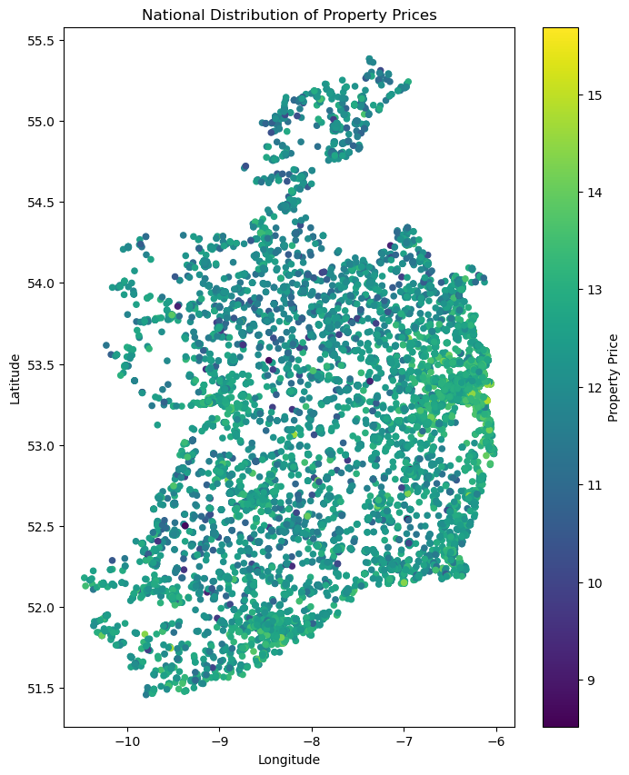
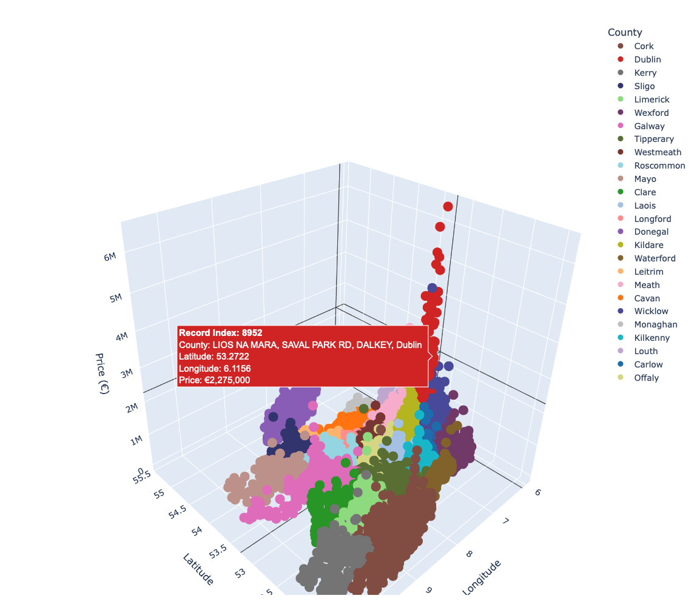

# Irish Housing
Clustering model for Irish housing prices based on geographical location. The dataset contains all properties sold in 2023, available through the public property register [here](https://www.propertypriceregister.ie/Website/NPSRA/pprweb.nsf/page/ppr-home-en).  

Data has been processed in the following way:

## Geocoding and Preprocessing
Google Maps API was used to determine locations from the address that was available in the property description. Usually, this method was accurate enough, only resulting in a handful of outlier values. These were mainly removed by constraining on the coordinates on only the country boundaries. The other issue with the dataset taken as it is, there are commercial properties that have been left on the register. Given the relatively small size, they have been removed manually, but there is an option to create a more complex filtering rule to rule them out, their primary characteristic being multiple house numbers (for a hypothetical, the commercial would be 17-24 Maple Street and residential 18 Wood Street), and a high price to account for the quantity. It is reasonable to assume that the processed dataset would not contain many of such entities.  

## Visualisation
Some baseline plots include the colour coding the geographical locations. These plots are demonstrated below for national prices:    

  

However, a more interesting approach, given low dimensionality, is to select prices as the z axis. From the screenshots below, this really gives a sense of disproportionate property values around major cities, and especially a clear "mountain" that slopes downward in the neighbouring counties, around Dublin City. The full interactive 3d visualisation can be found in the visualisation notebook (requiring plotly). 

  

## Clustering  
For the clustering procedure, the hierarchical agglomerative clustering was used. (There has been numerous attempts at other clustering, however this produced best results in terms of consistency). There has been some other attempts used, and in general (since there is no particularly straightforward objective metric for this exercise), the parameters that have been used were the most consistent with general pricing information available.

As demonstrated in the Clustering notebook, there has been evident clusters that have certain localities in common. In the Dublin case, the highest four out of five clusters by average price are associated with Dublin 4, while with the other neighbourhoods the situation is not associated particularly, except for Dublin 18 (this may be to an inefficiency that has been introduced with identifying particular Dublin localities).

For the nationwide case, there is a clear trend for Dublin being an absolute outlier (in fact the ten out of twenty-five clusters with the highest average price being dominated by Dublin, sometimes followed by the counties with other major cities like Galway and Cork, and semi-commuter counties like Meath and Louth).

This project overall is mostly an early proof of concept if unsupervised clustering methods are useful for identifying geographical dependencies, and in general given the identification of outliers and major high-price concentration areas, it has its merits. However there are disadvantages in terms of reliability, sensitivity to hyperparameters and precise metrics, as well as the computational requirements on particularly large datasets, and poor interpretability.

___

License: MIT
